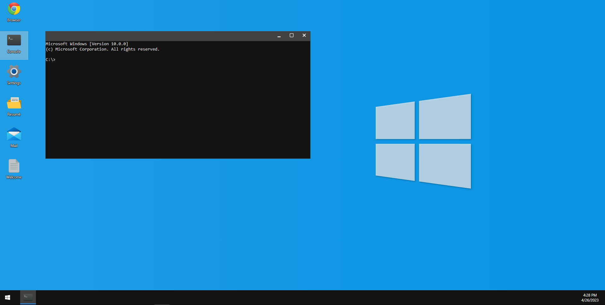

# [Windows Portfolio](https://ezequielarchi.github.io/Windows-Portfolio/)

This is a React-based frontend project that simulates the behavior of the Windows 10 operating system. The goal of this project is to provide a familiar and easy-to-use interface for users who are accustomed to using Windows.

## Features
The desktop contains different programs, each with their own set of features:

### Browser:
This application allows you to browse different web pages and has typical browser options such as the option to go back or forward in history, refresh the current page, go to a home page, or enter a URL in the search bar.  
Please note that not all pages allow connection within an embedded page for security reasons.

### Console:
This application recreates the Windows console along with some typical commands. At the same time, an example file system is provided for you to explore and view its contents.

### Settings:
This application allows you to configure various color parameters within the project, such as the main color where it is displayed, and the light or dark color system and desktop background color.

### Resume:
Here you can find my resume in a file that you can view.

### Mail:
Here you can see all the emails that have arrived for the user.

### Welcome:
A welcome message for the user.

### Taskbar:
In addition, you can find the Windows menu on the taskbar with some extra options and links if you are interested in this work done, as well as a calendar to manage your schedule.

## Technologies Used
This project was developed using React with the following libraries:

* Redux
* Styled Components
* Fontawesome Icons

## Contact
If you have any questions or comments about this project, feel free to [contact me](mailto:lucianoarchidiacono@gmail.com).  
  
Thanks for your time.